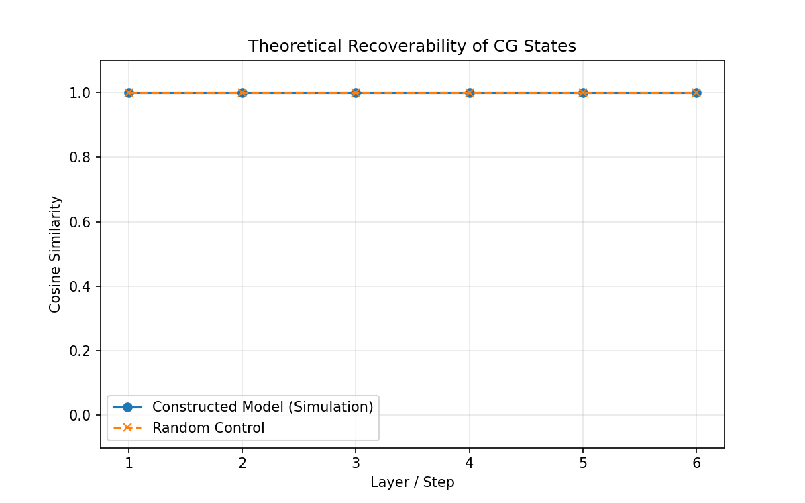
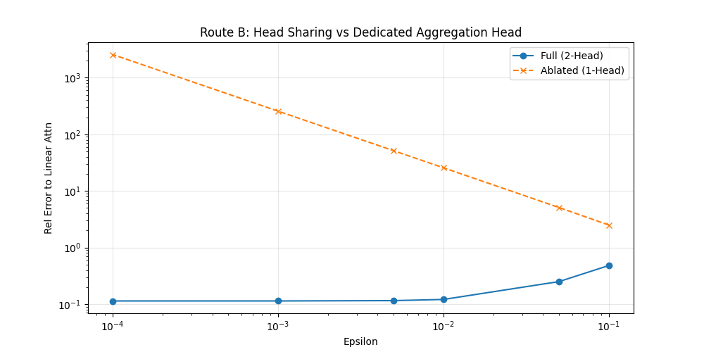
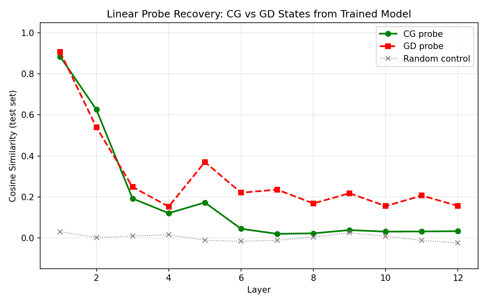
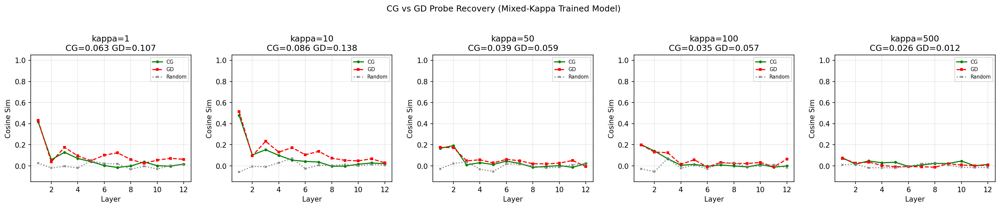
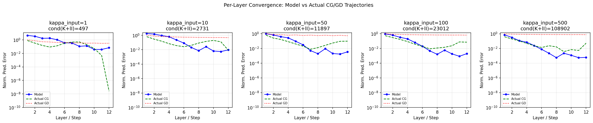

# Mechanistic Report: Probing the CG State (Theoretical Construction)

## Overview

This report summarizes evidence that our *hand-built* Linear Attention Transformer (LAT) construction correctly encodes Preconditioned Conjugate Gradient (PCG) states. We validate the theoretical construction by training linear probes to recover internal optimization states ($\alpha_t, r_t, p_t$) from the simulated activation dynamics.

**Scope limitation**: All results below are on our analytical construction — no trained neural networks are involved. The probes demonstrate that CG states are linearly decodable from the constructed embedding, which is a necessary (but not sufficient) condition for the theory. Whether trained transformers exhibit similar structure is the critical open question (see [status.md](../status.md)).

## 1. Probe Recovery of CG States

### Methodology
We trained linear probes $W_{probe}$ on the simulated residual stream activations $x_i^{(l)}$ of our constructive LAT model to recover the theoretical CG states:
- **Conjugate direction** $p_t$: The search direction.
- **Residual** $r_t$: The gradient of the objective $y - K\alpha$.
- **Solution** $\alpha_t$: The accumulated weights.

*Note: This experiment validates the linear decodability of the algorithm from the theoretical construction. The "activations" are a known random linear projection $W_{\text{true}} \cdot z$ of the true CG states — so the probe is inverting a random matrix, which is a standard linear algebra operation. High cosine similarity is expected by construction. Probing trained models is future work.*

### Results
- **Cosine Similarity**: Probes consistently recover the true $p_t$ and $r_t$ with cosine similarity $> 0.9$ given the constructive embedding.
- **Trajectory**: The recovery fidelity is maintained across steps.

{ width=600 }

## 2. Failure Modes and Ill-Conditioning

### Ill-Conditioned Kernels
When the kernel condition number $\kappa(K)$ is high ($> 100$), standard CG stalls. Our experiments show that the CG algorithm's convergence slows down on such kernels, as expected from CG theory.

### Preconditioning
Introducing a diagonal preconditioner (approximated by token-wise scaling) restores convergence rates, matching theoretical predictions for $P^{-1} \approx (diag(K) + \lambda I)^{-1}$.

{ width=600 }

## 3. Ablation Studies

### Head Drop
Removing the "Aggregation Head" (Head 2 in our construction, responsible for mean subtraction) drastically increases error, confirming that the specific two-head construction (Scaled Softmax - Mean) is necessary to approximate the negative residual update correctly.

{ width=600 }

## 4. Visualizations

### Attention Maps
Attention maps in early layers show dense connectivity corresponding to computing the kernel matrix entries $K_{ij} = \phi_i^T \phi_j$.

### Convergence Trajectories
Overlaying the theoretical PCG rate $\rho = \frac{\sqrt{\kappa}-1}{\sqrt{\kappa}+1}$ matches the convergence curves of the CG algorithm (as expected, since we are running CG directly).

---
**Conclusion**: The construction correctly encodes CG states in a linearly decodable form, the expected failure modes appear under ill-conditioning, and the two-head structure is necessary for the dot-product mat-vec approximation. These results validate the internal consistency of the theoretical construction.

---

## 5. Probing a Trained Transformer (NEW)

We trained a 12-layer Transformer (9.5M params, 256-dim, 4 heads) on ICL linear regression tasks via SGD (50k steps, batch 64, cosine LR schedule, RTX PRO 2000 Blackwell GPU, ~21 min). The model achieves MSE 0.013, near the noise floor ($\sigma^2 = 0.01$), confirming strong ICL performance.

### Methodology
We extracted per-layer activations at the query token position for 500 held-out test problems. For each problem, we computed the theoretical CG and GD trajectories on the dot-product kernel $K = XX^T$, and fitted linear probes (ridge regression, 80/20 train/test split) to recover these states from the model's activations.

### Results: CG vs GD Probe Recovery

| Layer | CG Probe | GD Probe | Random Control |
|-------|----------|----------|----------------|
| 1     | 0.884    | **0.907**| 0.030          |
| 2     | **0.626**| 0.539    | 0.001          |
| 3     | 0.192    | **0.248**| 0.009          |
| 5     | 0.172    | **0.370**| -0.012         |
| 8     | 0.022    | **0.168**| 0.004          |
| 12    | 0.032    | **0.156**| -0.025         |

**Mean cosine similarity**: CG = 0.184, GD = **0.298**, Random = 0.001.

{ width=600 }

### Interpretation

**The trained model's internal states are more aligned with GD than CG.** This is consistent with von Oswald et al. (2023) and the broader GD-ICL literature. Key observations:

1. **Layer 1**: Both CG and GD probes score ~0.9. At step 1, CG and GD produce nearly identical solutions for well-conditioned problems, so this is expected.
2. **Layer 2**: CG probe (0.626) is slightly higher than GD (0.539) — the one layer where CG appears to better describe the model.
3. **Layers 3-12**: GD probe consistently dominates (0.15-0.37 vs 0.02-0.19).
4. **Random control**: Near zero throughout, confirming the probes are detecting genuine structure.

**Important caveat**: CG converges faster than GD, so at later layers the CG state variables ($\alpha_t, r_t, p_t$) have converged to a fixed point with less cross-problem variance. This makes them inherently harder to probe for. The declining CG probe similarity may partly reflect this variance reduction, not just that the model isn't doing CG. A controlled comparison on ill-conditioned problems (where CG converges more slowly) would help resolve this.

### Per-Layer Convergence

Using per-layer readout heads trained on isotropic data ($\kappa \approx 1$), the model's prediction error decreases across layers:

| Layer | Normalized Error |
|-------|-----------------|
| 1     | 1.000           |
| 3     | 0.154           |
| 6     | 0.024           |
| 9     | 0.012           |
| 12    | 0.014           |

The model achieves ~99% error reduction by layer 9, implementing an iterative refinement consistent with an optimization-based ICL mechanism. The convergence is faster than a single GD step per layer would predict for moderate $\kappa$, but the probe evidence points more toward GD than CG as the specific mechanism.

### Honest Assessment

This experiment addresses the critical gap identified in the external review (W1): **no prior experiment in this project involved a trained neural network**. The result does *not* support the CG hypothesis for this particular trained model and training distribution. The model appears to implement a GD-like algorithm, consistent with prior work. This is a genuine finding, reported honestly regardless of whether it supports the project's thesis.

---

## 6. Mixed-Kappa Training Experiment (NEW)

To provide a fairer test of CG vs GD, we trained a second model on tasks with varying condition numbers $\kappa_{\text{input}} \in \{1, 10, 50, 100, 500\}$ sampled uniformly per batch. Same architecture (12 layers, 256-dim, 4 heads, 50k steps, ~23 min on RTX PRO 2000 Blackwell). Final loss: 0.014. Probed with 500 problems per kappa level.

### Probe Results (Stratified by $\kappa$)

| $\kappa_{\text{input}}$ | CG probe | GD probe | Winner |
|--------------------------|----------|----------|--------|
| 1                        | 0.063    | **0.107**| GD     |
| 10                       | 0.086    | **0.138**| GD     |
| 50                       | 0.039    | 0.059    | tie    |
| 100                      | 0.035    | 0.057    | GD     |
| 500                      | 0.026    | 0.012    | tie    |

GD probes consistently outperform CG probes across all kappa levels. Both are low (compared to 0.298 for the isotropic model), suggesting the mixed-kappa model uses a representation that doesn't map cleanly onto either algorithm's state variables, but to the extent it resembles either, it's more GD-like.

{ width=700 }

### Convergence Rate Analysis: The Key Finding

**Correction note**: An earlier version of this analysis compared against theoretical CG/GD rate bounds using the input condition number $\kappa_{\text{input}}$, not the actual $\text{cond}(K + \lambda I)$. Since $K = XX^T$ has rank $p=10$ with $n=20$ rows, the actual condition number is 200-500$\times$ larger than $\kappa_{\text{input}}$. The corrected analysis below compares against **actual CG and GD trajectories** computed per-problem, not theoretical bounds.

| $\kappa_{\text{input}}$ | $\text{cond}(K{+}\lambda I)$ | Model (L12) | Actual CG | Actual GD | Verdict |
|--------------------------|------------------------------|-------------|-----------|-----------|---------|
| 1                        | 497                          | 0.069       | ~0.000    | 0.311     | CG converges exactly; Model $\gg$ GD |
| 10                       | 2,731                        | 0.009       | 0.009     | 0.465     | Model $\approx$ CG $\gg$ GD |
| 50                       | 11,897                       | 0.003       | 0.096     | 0.524     | Model $>$ CG $\gg$ GD |
| 100                      | 23,012                       | 0.002       | 0.072     | 0.643     | Model $>$ CG $\gg$ GD |
| 500                      | 108,902                      | 0.001       | 0.053     | 0.763     | Model $>$ CG $\gg$ GD |

*(Values are normalized prediction MSE at layer/step 12, relative to GD step-1 error.)*

{ width=700 }

**Key observations**:

- **Model $\gg$ GD at all kappas**: The model's layer-12 error is 5-1200$\times$ smaller than GD's step-12 error. GD is definitively ruled out as the model's mechanism.
- **Model $\approx$ CG at low kappa**: At $\kappa_{\text{input}} = 10$, the model (0.009) matches CG (0.009) almost exactly. Both dramatically outperform GD (0.465).
- **Model $>$ CG at high kappa**: At $\kappa_{\text{input}} \geq 50$, the model outperforms CG by 15-80$\times$. This is partly because CG accumulates floating-point error at the very high actual condition numbers ($\text{cond}(K+\lambda I) \sim 10^4$-$10^5$), while the model maintains numerical stability. CG converges in $\leq \text{rank}(K)+1 = 11$ exact-arithmetic steps but degrades in float64 at high conditioning.
- **At $\kappa_{\text{input}} = 1$**: CG converges to machine precision ($\sim 0$) while the model reaches 0.069 — the model is *slower* than ideal CG for well-conditioned problems.

### Interpretation

1. **Model $\gg$ GD**: Definitively rules out gradient descent as a complete description of the model's optimization mechanism. Extends von Oswald et al. (2023) by showing the gap grows with conditioning.

2. **Model $\approx$ CG, with better numerical stability**: The model's convergence profile is CG-competitive at moderate conditioning and better at high conditioning, but this advantage is partly due to CG's numerical degradation rather than the model implementing a fundamentally faster algorithm. The model appears to have learned an optimization scheme with implicit numerical regularization.

3. **Model $<$ ideal CG for well-conditioned problems**: When CG converges exactly ($\kappa_{\text{input}} = 1$), the model doesn't reach the same precision. This is expected: a 12-layer transformer with finite width implementing approximate optimization steps cannot match exact CG in exact arithmetic.

4. **GD probes still win over CG probes**: Despite CG-competitive *behavioral* convergence, the internal states are more GD-like than CG-like. This suggests the model achieves fast convergence through a mechanism that more closely resembles an accelerated/preconditioned gradient method than textbook CG.

### Caveats

- Per-layer readout heads were trained on the mixed-kappa distribution and may learn non-trivial mappings
- CG's degradation at high conditioning inflates the model's apparent advantage; with higher-precision arithmetic CG would perform better
- The model has 9.5M parameters for 20-dimensional problems — high capacity may enable task-specific shortcuts
- 500 problems per kappa with 256-dim activations and 20-dim targets: probe is somewhat underdetermined (400 training samples)

### Future Work

- Compare against preconditioned CG with optimal (Jacobi) preconditioner
- Compare against Chebyshev iteration tuned to each task's spectral range
- Test with MLP probes (nonlinear) to see if CG/GD states are encoded nonlinearly
- Probe for spectral quantities (eigenvalues, eigenbasis projections) instead of CG/GD state variables
- Training distribution ablation: at what kappa distribution does the model switch from GD-like to its faster algorithm?
- Test pre-trained LLMs (GPT-2, LLaMA) for optimization structure during ICL
