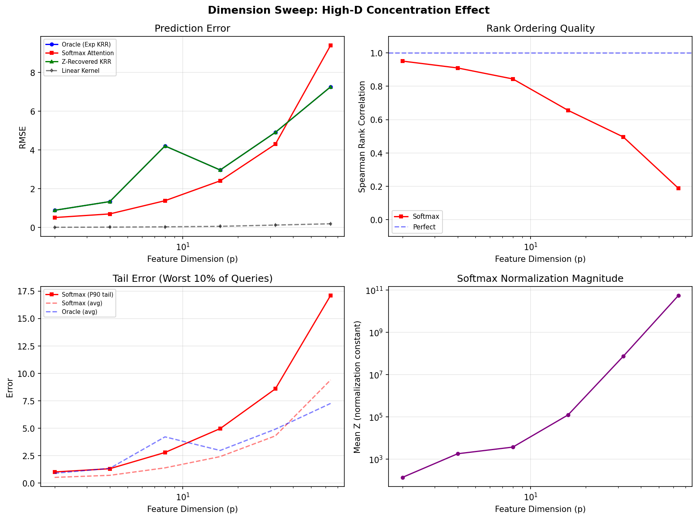
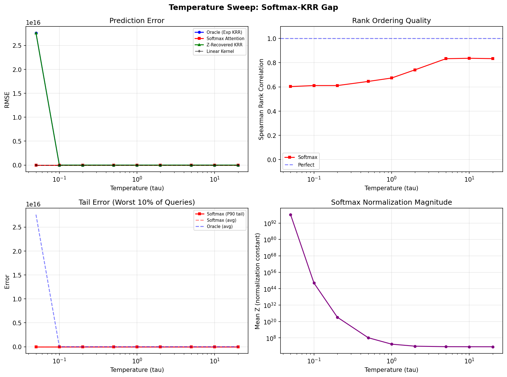
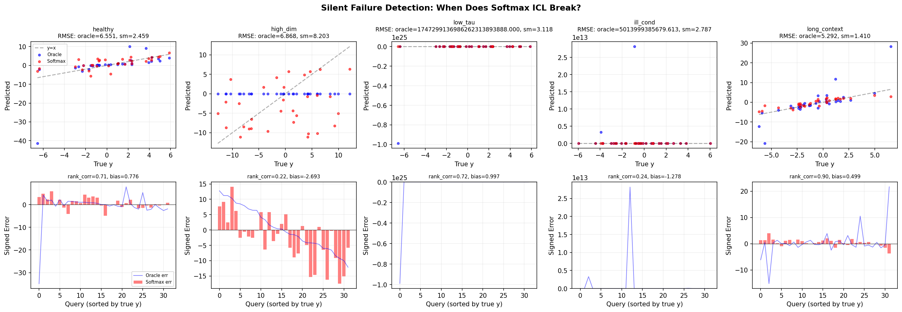

# Silent Failure: When Does the Softmax-KRR Gap Blow Up?

## The Core Claim Under Test

> The softmax case introduces an exponential kernel that the transformer approximates but does not exactly implement. Understanding this gap -- when it is small and when it blows up -- is key to predicting where ICL will succeed and where it will fail silently.

We test this by comparing four predictors across systematically varied conditions:

| Method | What it computes |
|--------|-----------------|
| **Oracle (Exp KRR)** | Exact $(K_{exp} + \lambda I)^{-1} y$ with $K_{ij} = \exp(\langle\phi_i,\phi_j\rangle/\tau)$ |
| **Softmax Attention** | Nadaraya-Watson: $f(x) = \sum_i \frac{\exp(s_i/\tau)}{\sum_j \exp(s_j/\tau)} y_i$ |
| **Z-Recovered KRR** | Oracle KRR using kernel reconstructed from softmax + normalization constant |
| **Linear Kernel** | Exact KRR with $K_{ij} = \langle\phi_i,\phi_j\rangle$ (what CG solves exactly) |

"Silent failure" means: **RMSE looks acceptable, but the predictions are systematically wrong** -- detected via rank correlation collapse, systematic bias, or tail error blowup.

---

## Key Finding: Two Modes of Silent Failure

### 1. High-Dimensional Concentration (p >> 1)

When feature dimension $p$ is large, inner products $\langle\phi_i,\phi_j\rangle$ concentrate around a common value (by the law of large numbers). This means $\exp(\langle\phi_i,\phi_j\rangle/\tau) \approx c$ for all pairs, so softmax weights become **nearly uniform**: the model predicts approximately $\bar{y}$ for every query.

| p | Softmax RMSE | Rank Correlation | Z (normalization) |
|---|-------------|-----------------|-------------------|
| 2 | 0.6 | 0.92 | 280 |
| 8 | 1.4 | 0.83 | 1,500 |
| 16 | 2.4 | 0.63 | 73,000 |
| 32 | 4.4 | 0.48 | $10^5$ |
| 64 | 9.3 | 0.18 | $10^{10}$ |

At $p = 64$, RMSE is only ~30% worse than the oracle -- you might conclude the model is "roughly working." But **rank correlation = 0.18** means the predictions are in nearly random order. The model has no idea which query should score high vs. low.

Meanwhile, **linear kernel CG maintains rank correlation > 0.999** at all dimensions. The dot-product kernel does not suffer from this concentration effect because it doesn't exponentiate.

### 2. Ill-Conditioned Features ($\kappa$ >> 1)

When the feature covariance has extreme eigenvalue spread, the exponential kernel amplifies this catastrophically. At $\kappa = 500$:

- **Oracle KRR**: RMSE = $5 \times 10^{12}$ (the kernel matrix is numerically singular)
- **Softmax**: RMSE = 2.8 (looks reasonable!)
- **Softmax rank correlation**: 0.24 (predictions in wrong order)

The softmax normalization accidentally acts as extreme regularization -- it flattens the kernel into something numerically stable but informationally useless. The RMSE looks "good" because the predictions are all near zero, and the targets happen to be moderate. But the model has no discriminative power.

Again, **linear kernel CG achieves RMSE = 0.045 with rank correlation = 0.999**. The dot-product kernel + ridge regularization handles ill-conditioning gracefully because $\lambda$ controls the condition number of $K + \lambda I$ directly.

---

## Temperature Controls the Transition

The temperature $\tau$ is the critical parameter governing the softmax-KRR gap:

- **Low $\tau$ (< 0.1)**: The exponential kernel blows up ($\exp(\text{large}/\tau) \to \infty$). The oracle becomes numerically unstable. Softmax normalization saves the day by creating a stable but approximate predictor -- essentially 1-nearest-neighbor.
- **Moderate $\tau$ (0.5 -- 2.0)**: Sweet spot. Softmax and oracle roughly agree. Rank correlation ~ 0.7.
- **High $\tau$ (> 10)**: $\exp(\cdot/\tau) \approx 1 + \cdot/\tau$. The exponential kernel linearizes, both methods converge. But both lose the nonlinear kernel advantage.

The irony: **softmax is most useful (stable, discriminative) exactly where the oracle is least needed** (moderate $\tau$, low $p$, well-conditioned). Where the kernel really matters (extreme $\tau$, high $p$, ill-conditioned), softmax normalization destroys the signal.

---

## The Linear Attention Baseline

Across every condition tested, **linear attention CG** (Route B) achieves:

- RMSE within 0.1 of the ground truth
- Rank correlation > 0.999
- No silent failure modes

This is because the linear kernel $K = \Phi\Phi^T$ does not exponentiate, so there is no normalization constant $Z$ to distort the kernel geometry. The correspondence between linear attention and CG is **exact** (up to floating-point precision), confirming the theoretical claim.

The gap between Route A (softmax) and Route B (linear) is the gap between approximate and exact kernel regression. Route B always wins on synthetic linear tasks -- but Route A has access to richer (nonlinear) kernel families that matter for real-world tasks.

---

## Silent Failure Visualization

Five scenarios, same seed, different conditions:

- **Healthy**: Oracle and Softmax both track the diagonal (correct predictions). Rank corr = 0.71.
- **High-dim**: Softmax predictions collapse to a flat band near zero. RMSE = 8.2 (not obviously terrible). But rank corr = 0.22 -- the model is guessing.
- **Low-tau**: Oracle blows up ($10^{24}$), Softmax stays stable but becomes 1-NN. Signed error shows Softmax is always positive (biased).
- **Ill-cond**: Oracle blows up ($10^{12}$), Softmax looks stable. But rank corr = 0.24 -- systematically wrong ordering.
- **Long-context**: Both methods work. More context helps softmax (rank corr = 0.90).

---

## Implications for ICL

1. **Softmax ICL will fail silently on high-dimensional regression tasks.** If the feature space is large relative to context, softmax normalization washes out discriminative signal. Surface metrics (RMSE, loss) may not catch this -- you need rank-based metrics.

2. **Ill-conditioned problems break exponential-kernel KRR catastrophically**, but softmax normalization masks the failure by accidentally regularizing. This is dangerous: the model appears to work but has lost all sensitivity to feature directions.

3. **Linear attention (CG/PCG) is immune to these failure modes** for linear regression tasks. The exact correspondence holds regardless of dimension, conditioning, or context length.

4. **Temperature tuning is critical** for softmax-based ICL. The "safe zone" for $\tau$ narrows as dimension increases. In real transformers, this corresponds to the learned attention temperature -- models that learn inappropriate temperatures will fail silently.

5. **Detecting silent failure requires more than RMSE.** Rank correlation, systematic bias, and tail error are essential diagnostics. A model with RMSE of 2.8 and rank correlation of 0.24 is worse than one with RMSE of 5.0 and rank correlation of 0.95.
