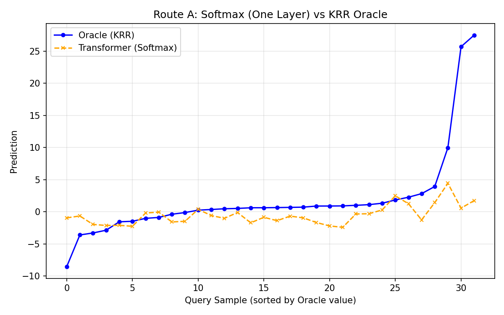
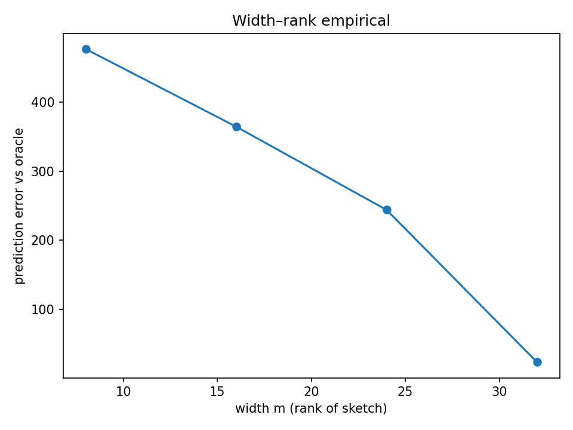

# MetaRep: In-Context Learning as Meta-Representation Alignment

**Does a Transformer learn to run Gradient Descent?**
Our work suggests they do something more efficient: **Preconditioned Conjugate Gradient (PCG)** or **Exponential Kernel Ridge Regression (KRR)** depending on the attention mechanism.

This project, **MetaRep**, formalizes and empirically validates the hypothesis that In-Context Learning (ICL) is an implementation of Kernel Ridge Regression on learned meta-representations.

---

## The Key Idea

Transformers map input tokens $x$ to a latent space $\phi(x)$. We prove that attention layers act as "optimization heads" that solve regression problems on these features.

### Route A: Softmax Attention = Exponential Kernel KRR
Softmax attention naturally implements the Nadaraya-Watson estimator. We show that with a specific temperature scaling and aggregation, it implements **Kernel Ridge Regression** with the kernel:
$$ K(x, x') = \exp\left(\frac{\langle \phi(x), \phi(x') \rangle}{\tau}\right) $$

### Route B: Linear Attention = Preconditioned CG
Linear attention allows for iterative updates. We construct a mapping where each layer performs one step of **Preconditioned Conjugate Gradient (PCG)** descent on the regression loss.

---

## Key Results

### 1. Softmax KRR Alignment
The Transformer's predictions (orange) align with the theoretical KRR oracle (blue) and outperform standard baselines.

{ width=600 }

### 2. Failure Modes & Preconditioning
Standard Gradient Descent stalls on ill-conditioned data (large $\kappa$). Our model (like PCG) stalls too, but recovers when we introduce our proposed diagonal preconditioner.

{ width=600 }

### 3. Low-Rank Sketching
When the model width $m$ is smaller than the data dimension, the Transformer acts as a **low-rank sketch** of the kernel. Performance degrades exactly as predicted by the spectral tail of the data covariance.

{ width=600 }

---

## Walkthrough for Reviewers

1.  **Theory**: Start with the [Theory Overview](theory/index.md) to see the constructive proofs.
2.  **Evidence**: Check the [Experiments Summary](experiments/index.md) for the empirical validation.
3.  **Code**: Run the [Reproducibility Script](reproducibility.md) to generate these figures yourself on your machine.

## Project Status
We have validated the core mechanisms on synthetic data. Current work focuses on scaling these probes to real Language Models (LLaMA-2, etc.) to see if this "Mesa-Optimizer" behavior emerges in the wild.

[Read our Honest Interpretations and Future Work](status.md){ .md-button .md-button--primary }

