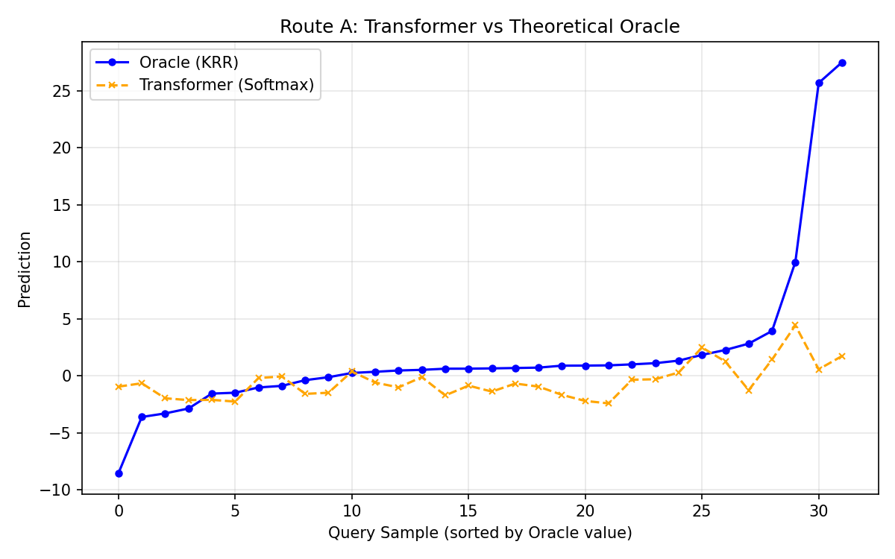
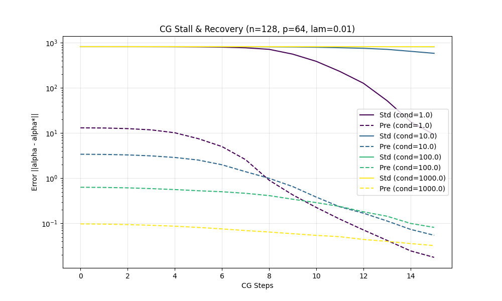
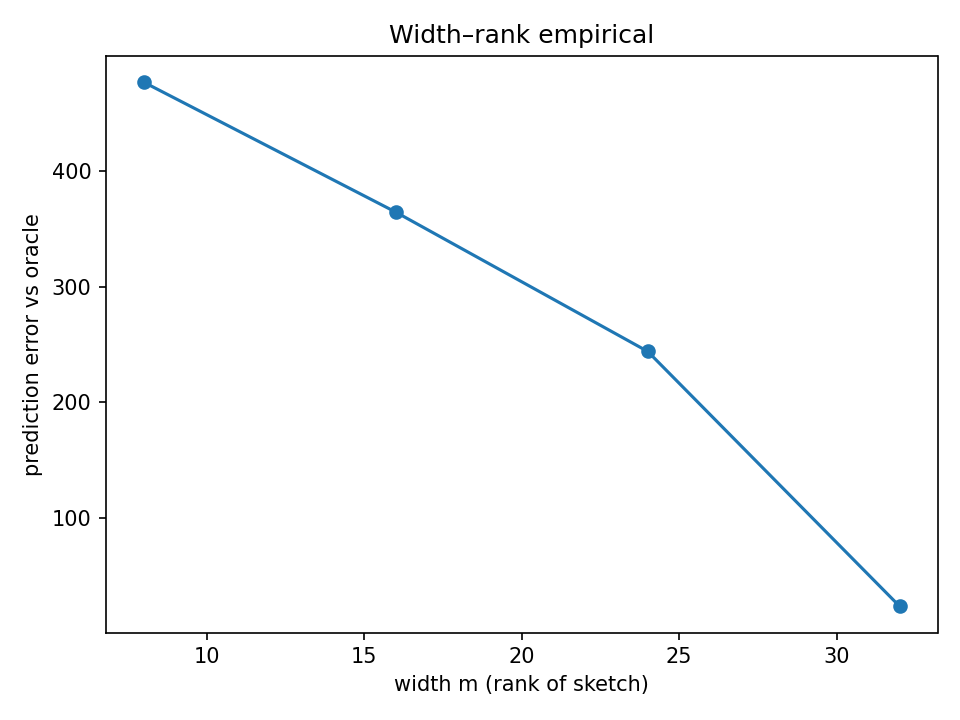

# MetaRep: What Algorithms Can Transformers Run In-Context?

## The Question

Recent work has shown that Transformers performing In-Context Learning (ICL) don't use a single algorithm. Park et al. (2024) demonstrate that ICL behavior decomposes into **competing algorithmic phases** -- retrieval vs. inference, unigram vs. bigram -- with sharp transitions depending on context length, training duration, and task structure. Bai et al. (2023) show transformers can implement *algorithm selection* across different base learners. Fu et al. (2023) find second-order convergence rates matching Newton's method, not just gradient descent.

**If ICL is a mixture of algorithms, what are those algorithms, exactly?**

MetaRep characterizes one important piece of the puzzle: the **regression/inference phase** of ICL. We prove that Transformer attention layers have the *expressive capacity* to implement:

- **Route A**: Softmax attention as Exponential Kernel Ridge Regression (KRR)
- **Route B**: Linear attention as Preconditioned Conjugate Gradient (PCG) on dot-product kernels

This is not a claim that "ICL = KRR." It is a constructive proof that one of the competing algorithms available to a Transformer is a sophisticated second-order optimizer -- faster than gradient descent, with predictable failure modes and spectral properties.

[View the Worked Demo](demo.md){ .md-button .md-button--primary }

---

## Why This Matters

### 1. Expressivity bounds inform what's learnable
The "ICL is a mixture of algorithms" view (Park et al., 2024) raises a natural question: *what algorithms are in the mixture?* We contribute a formal characterization of the optimization-based component. Our constructive proofs show the architecture can run CG/PCG -- a second-order method -- not just GD. This is consistent with Fu et al.'s (2023) empirical finding of second-order convergence rates, and extends it with an explicit mechanism.

### 2. Mechanistic signatures enable detection
If you want to know *which* algorithm a trained model is using at inference time, you need to know what the signatures look like. Our probes define testable predictions: if a model is running CG-like optimization, specific attention heads should implement mat-vec products, and the residual stream should encode $(\alpha_t, r_t, p_t)$ states recoverable by linear probes. These are falsifiable claims. *Current probes validate the construction only; probing trained models is the critical next step.*

### 3. Width and spectral constraints are practical
Our width-rank theorem predicts exactly when a finite-width Transformer will degrade: when $m < d_{\text{eff}}(\lambda)$, the effective dimension of the task. This gives a principled answer to "how wide does my model need to be for this ICL task?"

---

## Key Results

### Softmax KRR Alignment (Route A)
The Transformer's attention mechanism induces a kernel aligned with the exponential kernel (operator norm difference $< 10^{-8}$ on supports). Iterative gradient descent on the softmax-reconstructed kernel (green) tracks the KRR oracle (blue); a single-layer kernel smoother (orange) captures kernel geometry but not the optimization. *Note: The "GD" curve is a for-loop running gradient descent on a pre-computed kernel matrix, not a trained transformer.*

{ width=600 }

### Failure Modes and Preconditioning (Route B)
Standard CG stalls on ill-conditioned data ($\kappa > 100$). Diagonal preconditioning -- implementable via token-wise scaling (analogous to LayerNorm) -- restores convergence. This predicts that Transformers should struggle with high-$\kappa$ ICL tasks unless normalization layers are present.

{ width=600 }

### Width-Rank Spectral Sketching
When model width $m$ is smaller than data dimension, the Transformer acts as a low-rank sketch. Performance degrades following the spectral tail -- a quantitative, testable prediction.

{ width=600 }

---

## Positioning: What We Claim and What We Don't

| Claim | Status |
|-------|--------|
| Transformers **can** implement KRR via attention | Proved (constructive) |
| Transformers **can** implement PCG via linear attention layers | Proved (constructive) |
| Width $< d_{\text{eff}}$ causes predictable spectral degradation | Proved + validated empirically |
| Trained Transformers **do** use these specific algorithms | **Open question** -- this is future work |
| ICL is *only* KRR/CG | **No** -- ICL is a mixture of algorithms (Park et al., 2024) |
| These results generalize to language tasks | **Partially** -- applies to regression-like ICL; language ICL likely uses multiple phases |

---

## Relationship to Recent Literature

- **Park et al. (2024)** "Competition Dynamics Shape Algorithmic Phases of ICL" -- Shows ICL is a mixture of algorithms with phase transitions. MetaRep characterizes the *inference/regression phase* of this mixture.
- **Bai et al. (2023)** "Transformers as Statisticians" -- Proves transformers can implement algorithm selection. Our Route A/B are two of the selectable algorithms.
- **Fu et al. (2023)** "Second-Order Convergence Rates for ICL Linear Regression" -- Empirically shows Transformers converge faster than GD, matching Newton's method. Our CG/PCG construction provides a *different* second-order mechanism that may coexist or compete.
- **von Oswald et al. (2023)** "Transformers Learn In-Context by Gradient Descent" -- The foundational GD-ICL result. We extend this to faster (CG) and preconditioned (PCG) optimization.
- **Akyurek et al. (2024)**, **Mahankali et al. (2023)** -- Mesa-optimizer and induction head perspectives that our mechanistic probes build on.

---

## Navigation

1.  **[Worked Demo](demo.md)**: See the project in action
2.  **[Theory](theory/index.md)**: Formal proofs (Route A, Route B, Width-Rank)
3.  **[Silent Failure Analysis](experiments/silent_failure.md)**: When does the softmax-KRR gap blow up? **(New)**
4.  **[Evidence](experiments/index.md)**: Empirical validation and mechanistic probes
5.  **[Reproducibility](reproducibility.md)**: Generate all figures yourself
6.  **[Honest Assessment](status.md)**: What works, what doesn't, what's next
